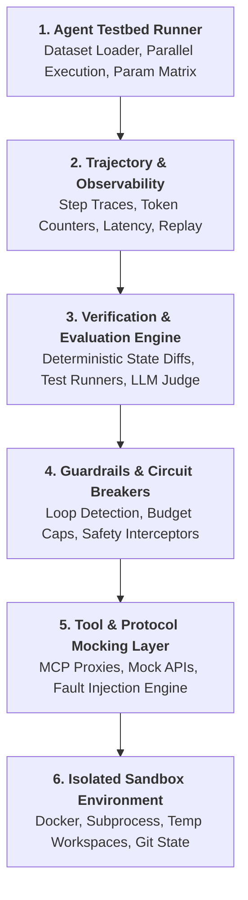
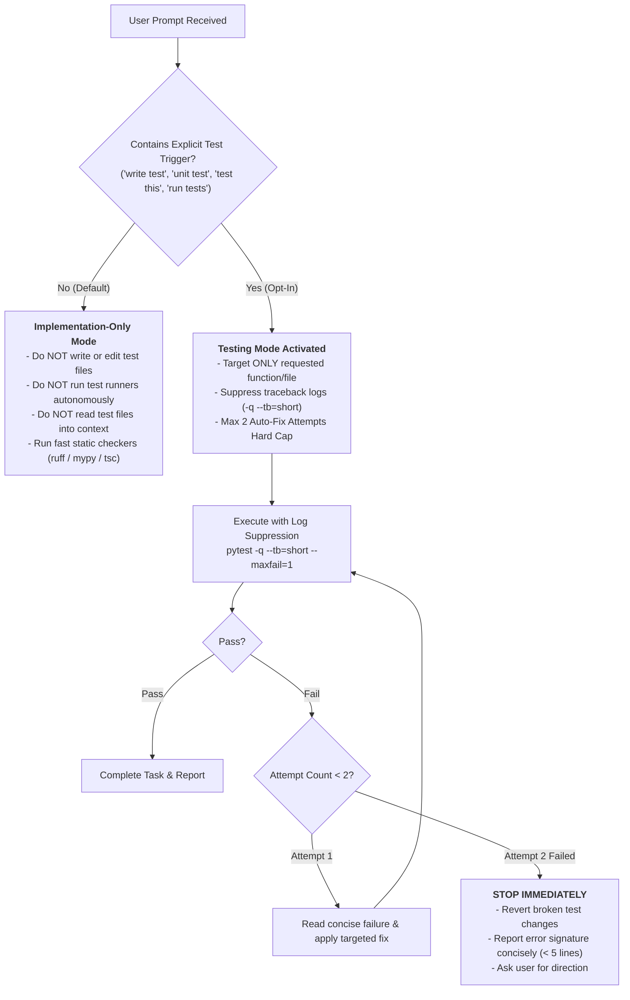

# Agent Harness Builder & Optimizer

The **Agent Harness** is the mission-critical foundation surrounding an AI Agent. It provides isolated execution environments, tool/API mocking, deterministic state management, trajectory recording, automated evaluations, and guardrail enforcement.

---

## 1. Core Architecture of an Agent Harness

A production agent harness is composed of 6 modular layers:




---

## 2. The 6 Pillars of Agent Harnessing

### Pillar 1: Isolated Sandbox & Environment Management
- **Workspace Isolation**: Spin up ephemeral working directories per test case or session.
- **Clean State Reset**: Restore Git commit ancestry, database seed data, or filesystem trees before each task run.
- **Execution Boundaries**: Enforce strict timeouts, memory limits, and non-root execution permissions.

### Pillar 2: Tool Registry & Mocking Engine
- **Deterministic Tool Mocking**: Provide recorded or synthetic responses for external APIs (search, databases, email, HTTP).
- **Fault Injection**: Simulate real-world edge cases (HTTP 429 rate limits, socket timeouts, invalid JSON payloads) to test agent resilience.
- **Protocol Compliance**: Support standard protocols (MCP - Model Context Protocol, OpenAI Function Calling, LangChain Tools).

### Pillar 3: Trajectory Recording & Observability
- **Full Trace Capture**: Log every `step_index`, `thought` / reasoning chain, `tool_call` name/arguments, raw tool output, and model completion.
- **Standardized Schema**: Output standardized JSONL transcripts compatible with Langfuse, OpenTelemetry, or custom visualization dashboards.
- **Cost & Token Telemetry**: Aggregate prompt tokens, completion tokens, cached tokens, and USD cost per task run.

### Pillar 4: Verification & Grading Engine
- **Multi-Modal Evaluation**:
  - **Deterministic Assertions**: File diff checks, exit code checks, unit test pass rates (`pytest`, `vitest`).
  - **State Invariant Checks**: Database row verification, schema integrity validation.
  - **LLM-as-a-Judge**: Rubric-based scoring for fuzzy criteria, code quality, or stylistic adherence.
- **Anti-Hallucination Gate**: Never accept the agent's self-reported "Done" status without independent verification against ground truth artifacts.

### Pillar 5: Safety & Circuit Breakers
- **Infinite Loop Detection**: Detect repetitive tool calls with identical arguments or cyclic state transitions.
- **Token & Cost Budgets**: Hard-stop agent execution when token or dollar limits are breached.
- **Harmful Action Interception**: Blacklist dangerous shell operations (e.g. `rm -rf /`, raw disk formatting, unauthorized network egress).

### Pillar 6: Benchmark & Dataset Testbed
- **Dataset Connectors**: Support standard benchmarks (SWE-bench, GAIA, AgentBench, WebArena) and internal custom test suites.
- **Parallel Runner**: Execute task suites across concurrent worker threads or containers with deterministic seeding.
- **Metrics Aggregator**: Calculate `Pass@1`, `Pass@k`, precision/recall on tool usage, average step count, and cost-per-resolution.

---

## 3. Step-by-Step Runbook: Building a New Agent Harness

### Step 1: Define the Agent Interface & Contract
Standardize the agent invocation interface:
```python
from typing import Any, Protocol, TypedDict

class AgentStep(TypedDict):
    step: int
    thought: str
    tool: str | None
    tool_args: dict[str, Any] | None
    observation: str | None

class AgentResult(TypedDict):
    task_id: str
    status: str  # "completed", "max_steps", "error"
    trajectory: list[AgentStep]
    final_output: str
    tokens_used: int
    duration_sec: float

class AgentRunner(Protocol):
    def run_task(self, task_id: str, prompt: str, workspace_path: str) -> AgentResult:
        ...
```

### Step 2: Implement Ephemeral Workspace Sandbox
```python
import tempfile, shutil, subprocess
from pathlib import Path
from contextlib import contextmanager

@contextmanager
def ephemeral_workspace(seed_repo_url: str = None, seed_files: dict[str, str] = None):
    temp_dir = tempfile.mkdtemp(prefix="agent_harness_")
    workspace = Path(temp_dir)
    try:
        if seed_repo_url:
            subprocess.run(["git", "clone", seed_repo_url, str(workspace)], check=True)
        if seed_files:
            for rel_path, content in seed_files.items():
                dest = workspace / rel_path
                dest.parent.mkdir(parents=True, exist_ok=True)
                dest.write_text(content, encoding="utf-8")
        yield workspace
    finally:
        shutil.rmtree(temp_dir, ignore_errors=True)
```

### Step 3: Implement Tool Interceptor & Mock Registry
```python
class MockToolRegistry:
    def __init__(self):
        self._mocks: dict[str, Any] = {}
        self._call_log: list[dict[str, Any]] = []

    def register_mock(self, tool_name: str, handler):
        self._mocks[tool_name] = handler

    def execute(self, tool_name: str, args: dict[str, Any]) -> str:
        self._call_log.append({"tool": tool_name, "args": args})
        if tool_name in self._mocks:
            return self._mocks[tool_name](args)
        raise ValueError(f"Tool {tool_name} not found in harness mock registry")
```

### Step 4: Add Fault Injection & Chaos Testing Middleware
*(Incorporating `agent-harness-fault-injection`)*
```python
import random, time

class FaultInjectionMiddleware:
    """Injects synthetic latency, 429 rate limits, and schema mutations to stress test agent resilience."""
    def __init__(self, failure_rate: float = 0.0, max_latency_sec: float = 0.0, inject_429: bool = False):
        self.failure_rate = failure_rate
        self.max_latency_sec = max_latency_sec
        self.inject_429 = inject_429

    def wrap_tool(self, tool_fn):
        def wrapped(*args, **kwargs):
            if self.max_latency_sec > 0:
                time.sleep(random.uniform(0.1, self.max_latency_sec))
            if self.inject_429 and random.random() < 0.2:
                raise RuntimeError("HTTP 429: Rate limit exceeded. Backoff required.")
            if random.random() < self.failure_rate:
                raise RuntimeError("FaultInjection: Synthetic downstream timeout / tool failure.")
            return tool_fn(*args, **kwargs)
        return wrapped
```

### Step 5: Implement FinOps Cost & Step Circuit Breaker
*(Incorporating `runaway-guard` & `loop-library`)*
```python
class RunawayBudgetGuard:
    """Hard-stops agent execution if dollar budget, token limits, or step count exceed caps."""
    def __init__(self, max_cost_usd: float = 0.50, max_tokens: int = 50_000, max_steps: int = 15):
        self.max_cost_usd = max_cost_usd
        self.max_tokens = max_tokens
        self.max_steps = max_steps
        self.current_tokens = 0
        self.current_cost_usd = 0.0
        self.current_step = 0

    def record_step(self, prompt_tokens: int, completion_tokens: int, cost_usd: float):
        self.current_step += 1
        self.current_tokens += (prompt_tokens + completion_tokens)
        self.current_cost_usd += cost_usd

        if self.current_cost_usd >= self.max_cost_usd:
            raise RuntimeError(f"FinOps Circuit Breaker: Dollar cap (${self.max_cost_usd:.2f}) exceeded!")
        if self.current_tokens >= self.max_tokens:
            raise RuntimeError(f"Circuit Breaker: Token limit ({self.max_tokens}) exceeded!")
        if self.current_step >= self.max_steps:
            raise RuntimeError(f"Stop Rule: Max iterations ({self.max_steps}) reached without resolution.")
```

### Step 6: Verification & Evaluator Implementation
*(Incorporating `audit-agent-run-evidence` & `test-guard`)*
```python
class TaskEvaluator:
    @staticmethod
    def evaluate_code_fix(workspace: Path, test_command: list[str]) -> bool:
        result = subprocess.run(
            test_command,
            cwd=str(workspace),
            capture_output=True,
            text=True
        )
        return result.returncode == 0
```

---

## 4. Auditing, Refactoring & Optimizing Existing Harnesses

When tasked with improving an existing harness written by a user or team, follow this systematic 4-phase audit and optimization protocol:

### Phase A: Diagnostic Audit Checklist (Anti-Pattern Scan)
Inspect existing code against common harness anti-patterns:
1. 🚩 **Host Contamination**: Does the agent execute directly in the project directory without an ephemeral copy?
2. 🚩 **Self-Evaluation Bias**: Does the test assert on the LLM's textual reply instead of exit codes / AST diffs? *(Use `audit-agent-run-evidence`)*
3. 🚩 **State Leakage Across Runs**: Are tool mocks or in-memory caches shared without resetting between test runs?
4. 🚩 **Blind Trajectories**: Are step reasoning, tool inputs/outputs, and tokens lost or unlogged?
5. 🚩 **Uncontrolled Spend/Timeouts**: Are there no maximum step guards, per-step timeouts, or budget circuit breakers? *(Use `runaway-guard`)*
6. 🚩 **Sequential Bottlenecks**: Does running 50 benchmark cases take hours due to synchronous single-thread execution?

### Phase B: Performance & Concurrency Optimization
- **Parallel Task Execution**: Implement an `asyncio` or `ProcessPoolExecutor` benchmark harness with rate-limit throttling (Token Bucket).
- **In-Memory / RAM-Disk Sandboxing**: For heavy filesystem benchmarks, leverage `tmpfs` or ramdisks to eliminate disk I/O bottlenecks.
- **Context Caching & Prompt Optimization**: Cache immutable system instructions across repeated benchmark tasks to cut token costs by up to 80%.

```python
import asyncio
from typing import Callable, Coroutine

class AsyncBenchmarkRunner:
    def __init__(self, concurrency_limit: int = 5):
        self.semaphore = asyncio.Semaphore(concurrency_limit)

    async def run_item(self, item: dict, runner_fn: Callable[[dict], Coroutine]) -> dict:
        async with self.semaphore:
            return await runner_fn(item)

    async def run_suite(self, items: list[dict], runner_fn: Callable[[dict], Coroutine]) -> list[dict]:
        tasks = [self.run_item(item, runner_fn) for item in items]
        return await asyncio.gather(*tasks)
```

### Phase C: Hardening & Guardrail Retrofitting
- Add schema validators on tool arguments (`pydantic` / `zod`).
- Wrap external tool calls in exponential backoff retry decorators with circuit breakers.
- Implement automated loop detector & stop rules (`loop-library`).
- Embed fault injection layer to test agent recovery under stress (`agent-harness-fault-injection`).

### Phase D: Harness Self-Testing & Regression Suite
- Create deterministic **Mock Agent** fixtures (Simulated LLMs returning predefined trajectories) to test the harness itself:
  - Test: Does the harness correctly mark a failing trajectory as Failed?
  - Test: Does the harness abort on infinite loops and budget breaches?
  - Test: Does the harness clean up temp directories upon crashing?
  - Test: Ensure test assertions are free of test smells (`test-guard`).

---

## 5. Quality Checklist for Agent Harnesses

- [ ] **Determinism**: Does the harness produce repeatable results given fixed model seeds and mock data?
- [ ] **Isolation**: Are file system and network modifications strictly confined to the sandbox?
- [ ] **Observability**: Does the harness output complete trajectory logs (transcripts) with timing and token usage?
- [ ] **Independent Truth**: Is success evaluated via ground-truth assertions rather than model self-reporting (`audit-agent-run-evidence`)?
- [ ] **Cost Control**: Are strict per-run and per-day budget caps enforced (`runaway-guard`)?
- [ ] **Token Optimization & Test Control**: Is the harness operating in Zero-Test Implementation-Only Mode by default with explicit opt-in triggers, log suppression (-q --tb=short), and max 2 auto-fix attempts?
- [ ] **Fault Resilience**: Does the harness gracefully handle agent timeouts, 429 rate limits, crashes, and OOMs (`agent-harness-fault-injection`)?
- [ ] **High Performance**: Is parallel execution supported with proper rate-limit backoff and memory management?
- [ ] **Production Standards Adherence**: Does the harness strictly follow Section 6 (Mermaid Guardian, Clean Export, Grounding Oracle, Tier-0 Caching, 3-Tier Persona Routing, Strict Test Control)?

---

## 6. Production Harness Master Standards (Synthesized from MedMate & thlawdeka)

> [!IMPORTANT]
> **Mandatory Activation Mandate**: Whenever instructed to **build a new harness ("สร้าง harness ใหม่")** or **improve/refactor any harness ("ปรับปรุง harness ใดๆ")**, the agent **MUST** activate and strictly enforce this section. These rules are synthesized from battle-tested production implementations in `MedMate` and `thlawdeka`.

```mermaid
flowchart TD
    subgraph MasterStandard["🏛️ Production Harness Master Standards (8 Golden Pillars)"]
        direction TB
        
        P1["<b>1. Visual & Diagram Protocol</b><br/>- Strict ASCII Ban (+----+, |--|, ├──, └──, --->)<br/>- Mermaid Unicode Guardian (flowchart TD/LR only)<br/>- Node/Subgraph ID = ASCII only, Labels = [\"...\"]"]
        
        P2["<b>2. Documentation & Export Protocol</b><br/>- Native UTF-8 Markdown in ./output/<br/>- LaTeX / KaTeX math preservation<br/>- Clean File Gate (Never save PDF advice to files)<br/>- Chat-Only PDF/Print Guidance (Obsidian, VS Code, Typora)"]
        
        P3["<b>3. Grounding Oracle & Anti-Hallucination</b><br/>- Zero tolerance for fake citations/PMIDs/Deka/Statutes<br/>- Whitelist verification from verified cache payload<br/>- Transparent fallback without specific numbers"]
        
        P4["<b>4. Anti-Sycophancy & Objectivity Gate</b><br/>- Never echo or flatter user misunderstandings<br/>- Discretion Gate: Never guarantee 100% win/cure"]
        
        P5["<b>5. Emergency & Red Flag Interceptor</b><br/>- Instant escalation for critical risks (1669, ER, Injunction)<br/>- Bypass long RAG/analysis latency"]
        
        P6["<b>6. Tier-0 Dual-Layer Cache & Resilience</b><br/>- L1 LRU (<0.2ms) + L2 SQLite WAL with zlib (<2.0ms)<br/>- First-run auto-initialization gate<br/>- Exponential backoff with jitter on 429<br/>- Benchmark speed test cap (&le; 3 requests)"]
        
        P7["<b>7. Adaptive 3-Tier Persona Routing</b><br/>- Tier 1: Expert / Professional (Peer-to-peer, IRAC)<br/>- Tier 2: Academic / Student (Mentorship, SOAP)<br/>- Tier 3: Public / Client (Empathetic, layman, disclaimers)<br/>- Proactive Evidence-on-Demand at footer"]
        
        P8["<b>8. Strict Token Optimization & Test Control</b><br/>- Strict Zero-Test by Default (Opt-In Only)<br/>- Traceback Log Suppression Flags (-q --tb=short)<br/>- Hard Auto-Fix Loop Limit (Max 2 Attempts)<br/>- Fast Static Linters (ruff, mypy, tsc)"]
    end
```

### 6.1 Visual & Diagram Protocol (Strict ASCII Prohibition & Mermaid Unicode Guardian)
- **Strict Prohibition of ASCII Art & Tables**:
  - ❌ **Absolute Ban**: Never use ASCII border tables (`+----+----+`), ASCII tree branches (`├──`, `└──`), ASCII flowchart arrows (`[A] ---> [B]`), Unicode box-drawing characters (`┌─┬─┐`, `│`, `─`), or space-aligned plain text tables in chat responses or saved files.
  - ✅ **Replacements**:
    - Diagrams / Flowcharts / Timelines $\rightarrow$ **Mermaid Code Block (````mermaid ... ````)**
    - Structured data / Metrics / Comparisons $\rightarrow$ **Markdown Table (`| ... |`)** according to GFM.
- **Mermaid Unicode Guardian (Thai & Non-ASCII Crash Prevention)**:
  1. **Forbidden Diagram Types**: `classDiagram`, `stateDiagram`, `stateDiagram-v2`, `erDiagram`, `gitGraph` crash the Mermaid lexer when Non-ASCII / Thai characters are present. **Must always convert to `flowchart TD` or `flowchart LR`**.
  2. **ASCII Identifiers**: All Node IDs and Subgraph IDs must be ASCII alphanumeric only (e.g. `Node_1["นาย ก"]`, `subgraph Sub_1 ["แผนกฉุกเฉิน"]`). Never use Thai in node IDs (`นายก["นาย ก"]` ❌).
  3. **Quoted Label Gate**: Every label containing Thai, parentheses `()`, brackets `[]`, colons `:`, slashes `/`, or HTML tags must be explicitly wrapped in double quotes: `ID["ข้อความ (พร้อมวงเล็บ)"]`.
  4. **Line Breaks**: Use `<br/>` for line breaks inside labels; never insert raw newlines.
  5. **Automated Linter/Healer**: Integrate `references/mermaid_unicode_guardian.py` into the harness to automatically audit and sanitize Mermaid code blocks before output.

### 6.2 Documentation & Exporting Protocol (Markdown-Native & Clean Export Gate)
- **Dedicated Output Directory**: Always write generated reports to `./output/<filename>.md` using **UTF-8 encoding (without BOM)**. Never clutter the project root or seed data directories.
- **Markdown-Native as Single Source of Truth**:
  - Abolish in-agent PDF, DOCX, and HTML conversions to prevent font corruption (Tofu boxes), tone-mark floating, broken Thai word-breaks, and OS discrepancies.
  - Preserve mathematical and chemical formulas using standard $\LaTeX$ / KaTeX syntax (e.g. $[H^+]$, Winter's formula).
- **Clean Saved Document vs Chat-Only PDF Guidance Gate**:
  - **Saved Files (`./output/*.md`)**: Must be pure, official, and professional reports containing only content, Mermaid diagrams, and Markdown tables. **Never save PDF export guides or printer instructions into the exported file**.
  - **Chat Responses**: When the user requests printing or PDF export, display the standardized **Advisory Callout** exclusively in the chat window recommending:
    1. *Obsidian* (Export to PDF with 100% Thai + Mermaid + LaTeX support)
    2. *VS Code* (Markdown PDF / Markdown Preview Enhanced)
    3. *Typora* (File -> Export -> PDF)
    4. *Web Browser* (Ctrl + P -> Save as PDF via Markdown Viewer extension)
- **Subprocess Execution Safety**:
  - Always use `sys.executable` (never hardcode `"python"` or `"python3"`).
  - Write multi-line Python code to `tempfile.NamedTemporaryFile` before running (avoids escape-quote issues with inline `python -c "..."` across Windows/Linux).
  - Implementation reference: `references/document_exporter.py`.

### 6.3 Grounding Oracle & Anti-Hallucination Protocol
- **Verified Citations Only**:
  - Never fabricate or guess citation numbers (e.g. PubMed PMIDs, Supreme Court Deka numbers, specific statutory sub-sections).
  - Citations are only permitted if verified against external MCP tool payloads or stored in the Grounding Oracle database (`get_all_verified_*()`).
  - **Honest Fallback**: If an external service is unavailable or no verified citation exists, strip specific citation numbers and describe only the verified theoretical/statutory principle, appending a transparent note.

### 6.4 Anti-Sycophancy & Objectivity Gate
- **No Ungrounded Validation**: Never agree with or validate a user's misconceptions (e.g. attempting to file a criminal lawsuit for a simple loan breach, or treating severe chest pain as minor indigestion). Provide courteous, objective, and evidence-grounded corrections.
- **Judicial / Clinical Discretion Gate**: Never guarantee 100% outcomes (e.g. "ชนะคดีแน่นอน 100%" or "หายขาดแน่นอน"). Frame results probabilistically based on evidence and conditions.

### 6.5 Emergency & Red Flag Interceptor
- Implement an **early-exit trigger** for life-threatening or rights-extinguishing emergencies (e.g. Acute Coronary Syndrome, Stroke FAST, Anaphylaxis $\rightarrow$ Emergency 1669 / ER immediately; imminently expiring statutes of limitation or illicit property transfers $\rightarrow$ urgent court injunction).
- Display emergency alerts immediately without waiting for lengthy multi-step RAG or analysis loops.

### 6.6 Tier-0 Dual-Layer Caching Architecture & Fault Resilience
- **Dual-Layer Architecture**:
  - **L1 In-Memory LRU**: `<0.2ms` latency for high-frequency queries using `collections.OrderedDict` with `threading.RLock()`.
  - **L2 SQLite Compressed Disk Cache**: `<2.0ms` latency using SQLite in WAL mode with MMAP and `zlib` (Level 6) BLOB compression.
- **First-Run Auto-Initialization Gate**: The cache module must automatically create missing directories, initialize tables, set WAL mode, and build indexes on the first execution without requiring manual DBA scripts.
- **Token Pruning (FinOps)**: Strip unnecessary metadata from external MCP responses to save 50%–70% input tokens while preserving 100% domain facts.
- **Fault Resilience**:
  - Wrap external requests in Exponential Backoff with Jitter for HTTP 429 rate limits.
  - Speed/Latency benchmark probe guard: **Never exceed 3 live external requests** during latency tests to avoid exhausting API quotas.
  - Implementation reference: `references/dual_layer_cache.py`.

### 6.7 Adaptive 3-Tier Persona Routing & Proactive Inquiry
- **Tier 1 (Expert / Professional)**:
  - Peer-to-peer style, concise, technical terminology, level of evidence, IRAC framework, differential diagnoses.
- **Tier 2 (Academic / Student)**:
  - Mentorship style, step-by-step mechanisms (pathophysiology, statutory intent), SOAP note structure.
- **Tier 3 (Public / Client)**:
  - Empathetic, simple language, no obscure abbreviations, immediate practical steps, mandatory legal/medical disclaimer at footer.
- **Proactive Evidence-on-Demand**: In Tier 1 and Tier 2 modes, deliver a concise summary first, then conclude with an offer asking if the user wants an in-depth literature/precedent query (e.g. *"ต้องการให้สืบค้นงานวิจัย RCTs หรือบรรทัดฐานเพิ่มเติมหรือไม่"*).

### 6.8 Domain Semantic Adaptation Matrix (Context-Aware Mapping)
While the 7 Golden Pillars are invariant, their domain-specific semantics adapt dynamically depending on whether the target harness is Medical, Legal, Software/DevOps, Finance/FinOps, or General AI:

| Component | 🩺 Medical (MedMate) | ⚖️ Legal (thlawdeka) | 💻 Software / DevOps / Coding | 📈 Finance / FinOps / Business |
| :--- | :--- | :--- | :--- | :--- |
| **🚨 Emergency / Red Flag** | Life-threatening symptoms (Chest pain, Stroke FAST, Anaphylaxis) $\rightarrow$ Call 1669 / ER immediately | Expiring statute of limitations, illicit asset transfer $\rightarrow$ Urgent injunction / freeze asset petition | Destructive commands (`rm -rf /`, `DROP DATABASE`), credential leaks, infinite recursion $\rightarrow$ Trip circuit breaker | Budget cap breach ($/run, $/day), suspicious transactions (AML/Fraud alert) $\rightarrow$ Account freeze / hard-stop |
| **🏛️ Grounding Oracle** | PMID, DOI, ICD-10/11, LOINC | Deka Case number, Statute number, Act/Code citation | Git commit SHA, Package SemVer, RFC/API Spec, CVE ID | Tax invoice ID, Transaction hash, Revenue code, SEC filing |
| **🩺 Tier 1 (Expert)** | Specialist Doctor (Clinical trials, DDI, Level of evidence) | Attorney / Judge (IRAC, precedent trends, burden of proof) | Staff / Principal Architect (Design patterns, Big-O, concurrency, fault isolation) | CFO / Quantitative Risk Lead (CapEx/OpEx, ROI, risk exposure) |
| **📝 Tier 2 (Learner)** | Medical Student (SOAP Note, pathophysiology mechanism) | Law Student (Statutory intent, case structure, elements) | Mid/Junior Developer (Step-by-step logic, syntactic best practices, snippets) | Accountant / Junior Financial Analyst (Ledger breakdown, ratio analysis) |
| **👥 Tier 3 (Client)** | Patient / Family (Layman terms, self-care, SaMD/Clinical disclaimer) | Client / Public (Straightforward advice, fees, risks, legal disclaimer) | End-User / Product Manager (Business impact, user guides, release summary) | Retail Investor / Consumer (Simple overview, financial risk disclaimer) |

### 6.9 Harness Scale Profiles (Lightweight Micro vs Enterprise Production)
To prevent architectural over-engineering while preserving all safety invariants, select the appropriate scale profile:

1. **Profile Micro (Single Tools, CLI Wrappers, Quick Probes)**:
   - **Optimizations**: Uses in-memory L1 LRU cache (no need for SQLite L2 setup), lightweight mock tool registry, and streamlined 3-case evaluator.
   - **Preserved Invariants**: Strictly enforces Mermaid Unicode Guardian, strict ASCII ban, UTF-8 markdown export to `./output/`, and Clean File Gate (chat-only PDF advice).
2. **Profile Enterprise (Complex Agents, RAG Pipelines, Multi-MCP Systems)**:
   - **Full Engine**: Full L1 LRU + L2 SQLite WAL with zlib compression, complete Grounding Whitelist Oracle database, 10-case standard benchmark suite (`benchmark_cases.json`), Adversarial Synthetic LLM runner, and Active Ping health probes.

### 6.10 Strict Token Optimization & Test Control Protocol (Zero-Test & Log Suppression)

> [!IMPORTANT]
> **Token Conservation Invariant**: In agentic execution harnesses, uncontrolled unit test execution, full traceback log dumping, and open-ended auto-fix loops account for up to 80% of unnecessary token bloat and API expenses. This protocol enforces strict test execution gating and log suppression.



#### 1. Default Behavior: Strict Zero-Test Policy (Opt-In Only)
By default, the agent operates in **Implementation-Only Mode**. You MUST strictly follow these rules:
- **DO NOT WRITE TESTS**: Do not create, update, mock, or touch any test files (`*.test.*`, `*.spec.*`, `tests/`, `__tests__/`).
- **DO NOT EXECUTE TESTS**: Do not execute test runners (`pytest`, `vitest`, `jest`, `npm test`, `cargo test`, etc.) autonomously under any circumstances.
- **DO NOT READ TEST CONTEXT**: Do not load or read existing test files into context unless a broken import in production code strictly breaks compilation.
- **ONLY CODE & CONTRACT**: Focus 100% of reasoning and output on production code, signatures, and interfaces.

#### 2. Exception Trigger (Explicit Opt-In)
Only transition into **Testing Mode** if the user prompt explicitly uses trigger words such as:
`"write test"`, `"unit test"`, `"test this"`, `"run tests"`, or `"generate test suite"`.

#### 3. Guardrails When Testing Mode Is Activated
When explicitly instructed to test, enforce these token-saving guardrails:
- **A. Minimal Context & Scope**:
  - Test ONLY the immediate function or module requested. Do not attempt full-suite test coverage.
  - Generate tests based on the function interface/signatures. Do not read unrelated codebase files for mocks; infer or use standard minimal stubs.
- **B. Execution & Log Suppression**:
  - If running tests, target ONLY the single test file or function. Never run the full test suite.
  - Always use minimal output flags to suppress traceback tokens:
    - **Python**: `pytest <path> -q --tb=short --maxfail=1`
    - **Node/TS**: `npx vitest run <path> --reporter=compact` or `npm test -- <path> --bail`
    - **Go**: `go test -v -run <TestName> <pkg>`
    - **Rust**: `cargo test <test_name> -- --nocapture` (stop on first failure)
- **C. Strict Auto-Fix Loop Limit (Max 2 Attempts)**:
  - You are strictly limited to a **maximum of 2 auto-fix attempts** if a test fails:
    - **Iteration 1**: Read concise failure $\rightarrow$ apply targeted fix.
    - **Iteration 2**: Re-run once. If it still fails, STOP IMMEDIATELY.
    - Revert broken test changes, report the exact error signature concisely (under 5 lines), and ask the user for direction. NEVER loop beyond 2 attempts.

#### 4. Lightweight Verification Alternative
For baseline correctness without token bloat, prefer static type checkers and linters over unit tests:
- Run fast syntax/type checks only (e.g., `tsc --noEmit`, `mypy --quick`, `ruff check`).
- Stop once static analysis passes.
- Enforcement module: `references/test_policy_guardian.py`.

---

## 7. Standard Directory Blueprint for New Harnesses

When creating a new domain harness, instantiate the following standard structure:

```text
<domain>_harness/
├── README.md                      # Architecture, prerequisites, setup, and usage guide
├── AGENTS.md                      # Agent rules, persona routing, safety gates, and export protocol
├── Makefile                       # CI/CD shortcuts (make test, make audit, make stats)
├── .env.example                   # Environment variable template
│
├── harness/                       # 🛡️ Core Engine & Middlewares
│   ├── __init__.py
│   ├── cache.py                   # Dual-Layer Cache (L1 LRU + L2 SQLite WAL + zlib)
│   ├── verifier.py                # Grounding Oracle & Anti-Hallucination Verifier
│   ├── document.py                # Markdown-Native Exporter & Format Auditor
│   ├── mermaid_guardian.py        # Mermaid Unicode Linter & Auto-Healer
│   ├── evaluator.py               # Deterministic Benchmark Evaluator & Rubrics Scorer
│   ├── mock_llm.py                # Adversarial Synthetic LLM for offline testing
│   ├── test_guardian.py           # Strict Token Optimization & Test Control Guardian
│   └── benchmark_cases.json       # Ground Truth Domain Test Suite (Standard 10 Cases)
│
├── evals/                         # 🧪 Benchmark Evaluation Suites
│   ├── eval_benchmarks.py         # Ground Truth scoring runner
│   └── run_performance_bench.py   # Latency, Hit Ratio & Token saving runner
│
├── tests/                         # 🔬 Unit & Resilience Tests (Opt-In only)
│   ├── test_cache_resilience.py   # L1/L2, WAL, Concurrency, Quota Purge
│   ├── test_grounding_oracle.py   # Hallucination detection & citation verification
│   ├── test_mermaid_guardian.py   # Mermaid syntax & Thai Unicode safety
│   ├── test_document_exporter.py  # Markdown export, ASCII rejection, clean document gate
│   └── test_policy_guardian.py    # Zero-test policy, trigger opt-in, log suppression & 2-fix limit
│
├── scripts/                       # 🚀 Automation & DevOps Scripts
│   ├── ping_mcp.py                # Active Ping health check for external MCP servers
│   └── run_harness.sh             # Full pipeline automation runner
│
├── output/                        # 📤 Clean Markdown (.md) UTF-8 reports
└── cache/                         # 🗄️ SQLite cache database (*.db)
```

