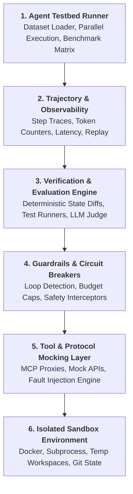

# 🛡️ HarnessMaster — Master Agent Harness & Evaluation System

**HarnessMaster** เป็นระบบและสภาพแวดล้อมสำหรับพัฒนา ออกแบบ ตรวจสอบ ปรับปรุง (Audit & Refactor) ประเมินผล (Evaluate) และเพิ่มประสิทธิภาพ (Optimize) ให้กับ **Autonomous AI Agent Harnesses** ในระดับ Production โดยเน้นความแม่นยำ (Deterministic Execution), การแยกสภาพแวดล้อมอย่างปลอดภัย (Sandbox Isolation), และการวัดผลบน Ground Truth

---

## 🎯 พันธกิจและบทบาทหลัก (Core Mission & Identity)

- **Role**: Lead Agent Harness Architect, Evaluation Specialist & Harness Optimizer
- **Objective**: 
  1. **สร้างระบบใหม่ (Build from Scratch)**: ออกแบบ Agent Execution Harnesses, Benchmark Suites, Mock Tool Layers และ Verification Guardrails
  2. **ตรวจสอบและยกระดับ Harness เดิม (Audit & Refactor Existing Harnesses)**: สแกนหา Anti-Patterns, แก้ไข Memory/State Leaks, ยกระดับ Sandbox Isolation, และแปลงระบบ Synchronous ให้รันแบบ Async Parallel ประสิทธิภาพสูง

---

## 🏗️ สถาปัตยกรรม 6 ชั้นของ Agent Harness (6-Layer Architecture)




---

## 📂 โครงสร้างโฟลเดอร์ในโปรเจกต์ (Workspace Structure)

```text
HarnessMaster/
├── README.md                                # รายละเอียดภาพรวมของโปรเจกต์ (ไฟล์นี้)
├── AGENTS.md                                # กฎระเบียบและบทบาทของ Agent ระดับ Workspace
├── Makefile                                 # คำสั่งลัดอัตโนมัติ (make audit, make test-templates, make scaffold)
├── scripts/                                 # 🚀 เครื่องมือ CLI อัตโนมัติประจำระบบ
│   ├── scaffold_harness.py                  # [One-Click] สร้าง Agent Harness ใหม่ครบวงจรใน 1 วินาที
│   └── audit_compliance.py                  # [Auditor] สแกนตรวจคุณภาพและตัดเกรดตาม Golden Standards
├── output/                                  # 📤 โฟลเดอร์จัดเก็บผลลัพธ์และรายงาน Markdown (.md) UTF-8
├── cache/                                   # 🗄️ โฟลเดอร์เก็บฐานข้อมูลแคช SQLite Tier-0
└── .agents/
    └── skills/                              # คลังทักษะเฉพาะทางสำหรับงาน Harness & Evaluation
        ├── agent-harness-builder/           # [Flagship] ออกแบบ, สร้าง, ตรวจสอบ และ Optimize Harness ครบวงจร
        │   └── references/                  # 📦 6 โมดูลอ้างอิงพร้อมใช้ (Mermaid, Exporter, Cache, Oracle, Mock LLM, Swarm)

        ├── agent-harness-fault-injection/   # จำลอง Fault & Chaos (Sandbox crash, Tool timeout, 429, schema corrupt)
        ├── audit-agent-run-evidence/        # ตรวจสอบพยานหลักฐาน (AST diff, logs, artifacts) ตาม Iron Law
        ├── runaway-guard/                   # FinOps Cost Safety ป้องกัน Token/Dollar รั่วไหล และคุม Hard Caps
        ├── loop-library/                    # คลังออกแบบ Bounded Feedback Loops, Stop Rules & Guardrails
        ├── agent-qa-result-triage/          # แยกแยะสาเหตุความล้มเหลว (Model defect vs Harness defect vs Infrastructure)
        ├── agent-evaluation/                # ประเมิน & Benchmark AI Agents (SWE-bench, GAIA, Trajectory)
        ├── ai-agents-architect/             # สถาปัตยกรรม ReAct, Plan-and-Solve, Memory & Multi-Agent
        ├── agent-memory-systems/            # สถาปัตยกรรม Memory (Episodic, Semantic, Procedural & Vector Retrieval)
        ├── ai-native-cli/                   # 98 กฎมาตรฐานสร้างคำสั่ง CLI และ Tool Interfaces ให้ Agent ใช้งานปลอดภัย
        ├── mcp-builder/                     # พัฒนาและเชื่อมต่อ Model Context Protocol (MCP) Servers
        ├── langfuse/                        # Tracing, Telemetry, Latency & Eval Datasets
        ├── tool-use-guardian/               # Guardrails ดักจับ Tool Failures และป้องกัน Infinite Loop
        ├── context-window-management/       # ป้องกัน Context Rot, Compaction & Sliding Window
        ├── prompt-engineering/              # ปรับปรุง System Prompts และแบบจำลองการให้คะแนน (Rubrics)
        ├── subagent-orchestrator/           # ประสานงานและกระจายงานให้ Subagents แบบคู่ขนาน
        ├── agent-orchestration-improve-agent/ # จูน Trajectory และประสิทธิภาพ Agent จากผลการทดสอบ
        ├── bug-hunt-swarm/                  # กระจาย Subagent หลายตัวค้นหาสาเหตุของบั๊กในโค้ดแบบขนาน
        ├── test-driven-development/         # ระเบียบวิธี TDD สำหรับสร้าง Tool Mocks & Evaluators
        ├── python-testing-patterns/         # Pytest Fixtures, Mock Servers & Async Testing
        ├── test-guard/                      # ตรวจจับ Anti-patterns ในโค้ด Test ป้องกัน Flaky Assertions
        └── systematic-debugging/            # วิเคราะห์ Root Cause เมื่อ Agent ทำงานผิดพลาด
```

---

## ⚡ สรุปทักษะเฉพาะทาง (Skills Matrix)

| Workflow / งาน | Skills หลักที่ใช้งาน | คำอธิบาย |
| :--- | :--- | :--- |
| **สร้าง & วางระบบ Harness ใหม่** | `agent-harness-builder`, `ai-agents-architect` | วางโครงสร้าง Sandbox, Mock Tool Registry, Execution Loops และ Test Runners |
| **Fault Injection & Chaos Testing** | `agent-harness-fault-injection`, `tool-use-guardian` | จำลอง Error จำลอง Network Timeouts, HTTP 429, State Corruption เพื่อทดสอบ Resilience |
| **ตรวจสอบหลักฐาน & Trajectory (Iron Law)** | `audit-agent-run-evidence`, `test-guard` | ตัดสินผลลัพธ์จาก AST diffs, Unit Test Logs และ Artifacts โดยไม่เชื่อคำพูดโมเดล |
| **FinOps Cost Control & Circuit Breaker** | `runaway-guard`, `loop-library` | กำหนดเพดานงบประมาณ ($/run, $/day) ป้องกัน Infinite Loops และ Retry Storms |
| **ตรวจสอบ & Optimize Harness เดิม** | `agent-harness-builder`, `systematic-debugging` | สแกนหาจุดรั่วไหลของ State, เพิ่ม Concurrency/Async, ฝัง Tracing และลดความ Flaky |
| **ประเมินผล & Triage ข้อผิดพลาด** | `agent-evaluation`, `agent-qa-result-triage`, `langfuse` | รันชุด Benchmark (SWE-bench, GAIA), แยกประเภทข้อผิดพลาด (Model vs Tool vs Infra) |
| **จำลอง Tools, CLI & Protocol** | `mcp-builder`, `ai-native-cli`, `tool-use-guardian` | สร้าง MCP Servers, จำลอง Mock APIs และสร้าง CLI Tool Contracts แบบ JSON |
| **ออกแบบ Memory & จัดการ Context** | `agent-memory-systems`, `context-window-management` | วางระบบ Semantic/Episodic Memory, ป้องกัน Context Degradation และทำ Summarization |
| **จูน Agent & Multi-Agent Swarms** | `agent-orchestration-improve-agent`, `bug-hunt-swarm`, `subagent-orchestrator` | ปรับแต่ง Trajectory จาก Benchmark, กระจายงานค้นหาบั๊กแบบขนานด้วย Subagents |
| **ทดสอบความถูกต้องของ Harness** | `test-driven-development`, `python-testing-patterns`, `test-guard` | พัฒนา Unit & Integration Tests สำหรับเครื่องมือและ Evaluator ก่อนรันโมเดลจริง |
| **ตรวจแก้บั๊กและ Loop** | `systematic-debugging`, `bug-hunt-swarm`, `loop-library` | หาสาเหตุที่แท้จริง (Root Cause) ของ Agent Failures และตัดวงจรการวนลูป |

---

## 🔍 กระบวนการตรวจสอบและยกระดับ Harness (Audit & Optimization Protocol)

เมื่อผู้ใช้นำโค้ด Harness เดิมมาให้ปรับปรุง ระบบจะดำเนินการตาม 4 ขั้นตอน:
1. **Diagnostic Audit (Anti-Pattern Scan)**:
   - ตรวจสอบว่ารันโค้ดบน Host ตรงๆ หรือไม่ (ขาด Sandbox Isolation)
   - ตรวจสอบว่า Evaluator ตัดสินจากคำพูดโมเดลหรือไม่ (ขาด Deterministic Assertions — ตรวจด้วย `audit-agent-run-evidence`)
   - ตรวจสอบการปนเปื้อนของ Mock State ข้ามรอบการทดสอบ
   - ตรวจสอบว่ามี Hard Budget Cap ป้องกันต้นทุนบานปลายหรือไม่ (`runaway-guard`)
2. **Performance & Concurrency Optimization**:
   - ปรับเปลี่ยนชุดทดสอบขนาดใหญ่ให้รองรับ **AsyncIO / Multiprocessing Batch Execution** พร้อม Rate Limiting (Token Bucket) ป้องกัน HTTP 429
   - เพิ่ม RAM Disk / In-Memory Mocking เพื่อลด Disk I/O Bottleneck
3. **Hardening & Guardrails Retrofitting**:
   - ติดตั้ง Schema Validator บน Tool Arguments และเพิ่ม Loop Detector อัตโนมัติ (`loop-library`)
   - ติดตั้ง Fault Injection Engine เพื่อทดสอบ Edge Cases (`agent-harness-fault-injection`)
4. **Harness Regression Testing**:
   - สร้าง Mock Agent จำลองเพื่อทดสอบตัว Harness เอง ให้มั่นใจว่าไม่เกิด False Positive / False Negative (`test-guard`)

---

## ⚖️ กฎเหล็กและมาตรฐานคุณภาพ (Engineering Quality Gates)

1. **Deterministic Verification (Iron Law)**:
   - ห้ามตัดสินผลลัพธ์จากข้อความบอกเล่าของ Agent เอง ("Done" หรือ "สำเร็จแล้ว")
   - ผลลัพธ์ต้องได้รับการตรวจทานกับ **Ground Truth** เสมอ เช่น Unit Test Exit Codes, AST / Git Diffs, Database State หรือ Deterministic Oracle Checks (`audit-agent-run-evidence`)
2. **Sandbox Isolation**:
   - การทดสอบหรือรัน Benchmark ต้องทำงานใน Ephemeral / Isolated Workspace เสมอ ไม่กระทบต่อ Host Repository
3. **Traceability by Default**:
   - ทุก Step ของ Agent จะต้องบันทึก: `step_index`, `thought`, `tool_name`, `arguments`, `raw_output`, `latency` และ `token_usage`
4. **Fault Injection & Chaos Hardening**:
   - ระบบ Harness ต้องมีเครื่องมือทดสอบ Edge Cases เช่น HTTP 429 Rate Limits, Network Timeout, Corrupted Tool Outputs และ Sandbox Failures (`agent-harness-fault-injection`)
5. **FinOps Cost Safety & Bounded Execution**:
   - ทุก Execution Loop ต้องกำหนด Per-Run และ Per-Day Dollar Budget Cap และมี Stop Rules ที่ชัดเจน (`runaway-guard`, `loop-library`)
6. **High Throughput & Concurrency**:
   - ระบบ Harness ต้องรองรับการประเมินผลแบบขนาน (Parallel Batch Execution) โดยไม่เกิด Race Conditions หรือ State Leakage
7. **Test-First Implementation (TDD)**:
   - เขียน Unit Test และ Mock สำหรับ Tool และ Evaluator ให้พร้อมก่อนส่งงานให้ Agent รันจริง พร้อมตรวจจับ Test Smells ด้วย `test-guard`
8. **Mandatory Production Harness Standards (Synthesized from MedMate & thlawdeka)**:
   - ทุกครั้งที่มีการ **สร้าง harness ใหม่** หรือ **ปรับปรุง harness เดิม**:
     - **ห้ามใช้ ASCII Diagrams/Tables เด็ดขาด**: ใช้บล็อก Mermaid (`flowchart TD/LR`) + Markdown Tables ตามมาตรฐาน GFM และคุมด้วย `MermaidUnicodeGuardian`
     - **Markdown-Native UTF-8 Exporter**: ส่งออกไฟล์ `.md` ลงใน `./output/` เท่านั้น คงรูปสูตร $\LaTeX$ พร้อมนโยบาย Clean File Gate (ห้ามใส่คู่มือ PDF ลงไฟล์ แต่ให้แนะนำใน Chat เท่านั้น)
     - **Grounding Whitelist Oracle**: คัดกรองเลขอ้างอิงจริง ป้องกันข้อมูลหลอน (Anti-Hallucination)
     - **Anti-Sycophancy Gate**: ยึดความถูกต้องเป็นกลาง ไม่เออออตามผู้ใช้ และไม่การันตีผลลัพธ์ 100%
     - **Emergency / Red Flag Gate**: ตัดลูปขึ้นเตือนวิกฤตทันที
      - **Tier-0 Dual-Layer Cache**: ติดตั้ง L1 LRU + L2 SQLite WAL (zlib Level 6) พร้อม First-Run Auto-Init และ Backoff บน 429
      - **Adaptive 3-Tier Routing**: สลับโหมดคำตอบระหว่าง ผู้เชี่ยวชาญ / นักศึกษา / คนทั่วไป พร้อม Proactive Evidence Inquiry
    - *โมดูลอ้างอิงพร้อมใช้งาน*: ดูที่ `.agents/skills/agent-harness-builder/references/`

---

## 📦 โมดูลอ้างอิงระดับ Production ทั้ง 6 ตัว (Production Reference Modules)

ตั้งอยู่ในโฟลเดอร์ [`.agents/skills/agent-harness-builder/references/`](file:///.agents/skills/agent-harness-builder/references/) พร้อมให้ดึงไปติดตั้งใน Harness ทุกตัวทันที:

| โมดูลอ้างอิง | ความสามารถหลัก | ผลการทดสอบ Sanity |
| :--- | :--- | :---: |
| 🛡️ **`mermaid_unicode_guardian.py`** | ตรวจสอบไวยากรณ์ Mermaid, บังคับใช้ `flowchart TD/LR`, ครอบ Double Quotes `["..."]`, แปลง Node ID เป็น ASCII ป้องกันภาษาไทยพัง | ✅ ผ่าน 100% |
| 📝 **`document_exporter.py`** | บันทึกไฟล์ Markdown UTF-8 ลงใน `./output/`, บล็อกตาราง ASCII, คงรูปสูตร $\LaTeX$ พร้อมคุม Clean File Gate | ✅ ผ่าน 100% |
| ⚡ **`dual_layer_cache.py`** | แคชสองชั้น L1 In-Memory LRU (<0.2ms) + L2 SQLite WAL (zlib Level 6) (<2.0ms), Auto-init, ประหยัด Token 50%–70% | ✅ ผ่าน 100% |
| 🏛️ **`grounding_oracle.py`** | สกัด Citation ตรวจสอบกับ Verified Whitelist Payload, ป้องกันข้อมูลหลอน, แบนการันตี 100% | ✅ ผ่าน 100% |
| 🧪 **`mock_llm.py`** | จำลองการตอบของ Agent แบบออฟไลน์ (Golden Case & Adversarial Injected Defect) เพื่อรัน CI/CD โดยไม่ต้องเสียค่า API | ✅ ผ่าน 100% |
| 🐝 **`swarm_testbed.py`** | ตรวจจับ Ping-Pong Infinite Loop, Deadlock, และควบคุมงบประมาณรวมของระบบ Multi-Agent Swarm | ✅ ผ่าน 100% |

---

## 🔄 การปรับบริบทตามโดเมนและขนาดของงาน (Semantic Adapter & Scale Profiles)

### 1. ตารางแปลงความหมายอัตโนมัติ (Domain Semantic Mapping Matrix)

| องค์ประกอบ | 🩺 การแพทย์ (Medical) | ⚖️ กฎหมาย (Legal) | 💻 ซอฟต์แวร์ / DevOps | 📈 การเงิน / FinOps |
| :--- | :--- | :--- | :--- | :--- |
| **🚨 Red Flag** | อาการวิกฤต (Chest pain, FAST) $\rightarrow$ โทร 1669 / ER | ขาดอายุความ, ยักย้ายถ่ายเททรัพย์ $\rightarrow$ อายัดด่วน | คำสั่งอันตราย (`rm -rf`), Secret Leak $\rightarrow$ ตัด Circuit Breaker | งบรั่วไหล ($/day cap), Fraud Alert $\rightarrow$ Freeze ทันที |
| **🏛️ Oracle ID** | PMID, DOI, ICD-10/11, LOINC | เลขฎีกา, เลขมาตรา, พ.ร.บ. | Git SHA, SemVer, API Spec, CVE | Transaction Hash, เลขผู้เสียภาษี, SEC ID |
| **🩺 Tier 1** | แพทย์ (Clinical Trials, DDI) | ทนายความ (IRAC, บรรทัดฐานฎีกา) | Staff Architect (System Design, Big-O) | CFO / Risk Lead (CapEx, ROI) |
| **📝 Tier 2** | นศพ. (SOAP Note, พยาธิสรีรวิทยา) | นศ.กม. (เจตนารมณ์, โครงสร้างมาตรา) | Mid/Jr Dev (Step logic, Syntax best practice) | Accountant / Analyst (ผังบัญชี, อัตราส่วน) |
| **👥 Tier 3** | คนทั่วไป (เข้าใจง่าย, คำเตือน SaMD) | ลูกความ (เข้าใจง่าย, คำเตือนกฎหมาย) | End User / PM (Business Value, คู่มือ) | Consumer (สรุปเข้าใจง่าย, คำเตือนการลงทุน) |

### 2. เลือกระดับความหนาของสถาปัตยกรรม (Harness Scale Profiles)

- **Profile Micro**: สำหรับสคริปต์สั้นหรือเครื่องมือเดี่ยว (ใช้ L1 Memory Cache, ชุดทดสอบกระชับ คงกฎแบน ASCII และ Clean File Gate ครบถ้วน)
- **Profile Enterprise**: สำหรับระบบ Agent เต็มรูปแบบ (ใช้ L1/L2 WAL zlib, Grounding Oracle DB, Benchmark Suite 10 เคสมาตรฐาน)

---

## 🛠️ เครื่องมืออัตโนมัติประจำระบบ (Turnkey Automation & Tooling)

HarnessMaster มาพร้อมเครื่องมือ CLI อัตโนมัติที่ช่วยให้การสร้างและตรวจสอบ Harness เป็นไปได้อย่างรวดเร็วและแม่นยำ:

```bash
# 1. ตรวจสอบความถูกต้องและตัดเกรดของ Harness (Compliance Auditor)
python3 scripts/audit_compliance.py <path_to_harness>
# ตัวอย่าง: สแกนและซ่อมแซมบล็อก Mermaid อัตโนมัติ
python3 scripts/audit_compliance.py <path_to_harness> --fix

# 2. สร้าง Harness ใหม่ระดับ Production แบบ One-Click Scaffolder
python3 scripts/scaffold_harness.py --name <project_name> --domain <medical|legal|software|finance|general> --profile <micro|enterprise>

# 3. รันการทดสอบโมดูลอ้างอิงทั้งหมดใน references/
make test-templates

# 4. ดูคำสั่งทั้งหมดที่รองรับ
make help
```

